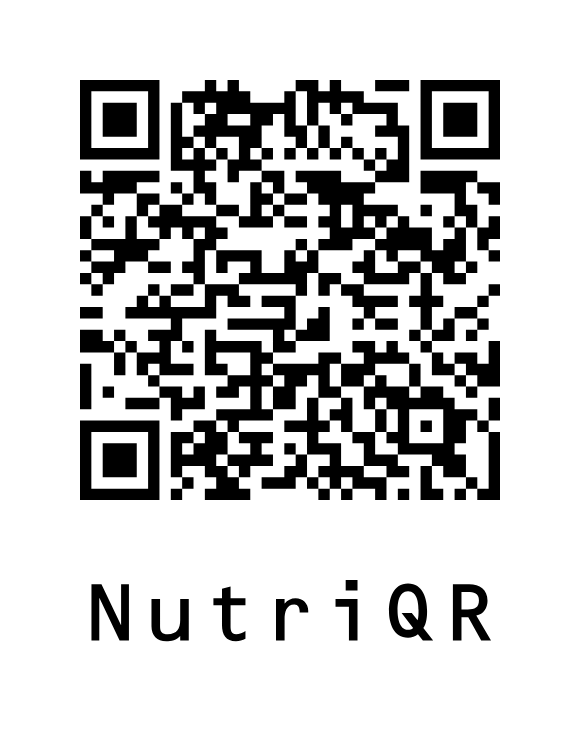

# NutriQR

> Ultra-compact nutrition data encoding for QR codes

[](LICENSE)

NutriQR is a specification and library ecosystem for encoding complete nutrition information into ultra-compact QR codes. By packing all mandatory EU nutrition labeling data into under 160 bytes (depending on product name and manufacturer name), NutriQR enables offline nutrition tracking and fast product identification without relying on external databases.

## 🎯 Purpose

Traditional nutrition apps rely on cloud databases for product information, leading to:

- Slow lookup times and poor offline experiences
- Incomplete or outdated nutrition data
- Privacy concerns from data tracking
- High infrastructure costs for app developers

NutriQR solves these problems by embedding complete nutrition information directly in QR codes that can be printed on product packaging, enabling:

- **Instant offline scanning** - No internet required for nutrition data
- **Complete nutrition profiles** - All mandatory EU labeling data included
- **International compatibility** - Supports both metric (g/ml) and imperial (oz/fl oz) units
- **Product linking** - Optional GTIN-13 support for external database integration
- **Ultra-compact encoding** - Fits in small QR codes suitable for packaging

## 📋 Specification

The complete technical specification is available in [`spec.md`](spec.md).

NutriQR encodes nutrition data as a minified JSON array with six fixed positions:

```js
[
  "8720828249062", // GTIN-13 product identifier
  "Upfront|Eiwit Oats", // Brand|Product name
  "g", // Base unit (g/ml/oz/fl)
  100, // Base quantity
  0.4, // Portion multiplier
  [415, 13, 5.6, 43, 9.7, 0.47, 25, 8.5], // Nutrients (kcal,fat,sat fat,carbs,sugars,salt,protein,fiber)
];
```

This example encodes complete nutrition information for a 100g portion of oats in just 82 bytes (once minified).

<table>
  <tr>
    <td style="vertical-align:top; text-align:center;">
      <br />
      <figcaption style="text-align:center;">The above example as a QR code</figcaption>
    </td>
  </tr>
</table>

## 📦 Packages

### Available

| Package                   | Language              | Status     | Description                                                |
| ------------------------- | --------------------- | ---------- | ---------------------------------------------------------- |
| [`nutriqr`](packages/ts/) | TypeScript/JavaScript | ✅ **WIP** | Full encoding/decoding with unit conversion and validation |

### Planned

| Package   | Language | Status             | Timeline                     |
| --------- | -------- | ------------------ | ---------------------------- |
| `nutriqr` | Swift    | 🔄 **In Progress** | iOS-first implementation     |
| `nutriqr` | Kotlin   | 🔄 **In Progress** | Android-first implementation |
| `nutriqr` | Python   | 📋 **Maybe**       | Data science and backend use |
| `nutriqr` | C#       | 📋 **Maybe**       | .NET ecosystem support       |

## 🚀 Quick Start

### TypeScript/JavaScript

<!-- ```bash
npm install nutriqr
``` -->

```typescript
import { createNutriQRString, decodeNutriQRString } from "nutriqr";

// Create a NutriQR string
const nutriqr = createNutriQRString(
  "8720828249062",
  "Upfront",
  "Eiwit Oats",
  "g",
  100,
  0.4,
  {
    energyKcal: 415,
    fat: 13,
    saturatedFat: 5.6,
    carbs: 43,
    sugar: 9.7,
    salt: 0.47,
    protein: 25,
    fiber: 8.5,
  }
);

// Decode a NutriQR string
const decoded = decodeNutriQRString(nutriqr);
console.log(decoded.product); // "Eiwit Oats"
console.log(decoded.nutrients.protein); // 10 (per 40g portion)
```

## 🔧 Development

### Prerequisites

- Node.js 18+ (for TypeScript package)
- Git

### Setup

```bash
git clone https://github.com/nagsterFVZ/nutriqr.git
cd nutriqr/packages/ts
npm install
npm test
```

## 🤝 Contributing

We welcome contributions! Whether you're:

- Implementing NutriQR in a new language
- Improving existing packages
- Enhancing the specification
- Adding documentation or examples

Please feel free to open issues and pull requests.

### Adding New Language Packages

If you'd like to implement NutriQR in a new language:

1. Create a new directory under `packages/`
2. Follow the specification in [`spec.md`](spec.md)
3. Implement the core functions: encode, decode, validate
4. Add comprehensive tests
5. Include unit conversion utilities
6. Update this README

## 📄 License

This project is licensed under the MIT License - see the [LICENSE](LICENSE) file for details.

## 🔗 Links

- [Technical Specification](spec.md) - Complete NutriQR format specification
- [TypeScript Package](packages/ts/) - Reference implementation
- [GitHub Repository](https://github.com/nagsterFVZ/nutriqr) - Source code and issues

---

_Built with ❤️ for better nutrition transparency_
